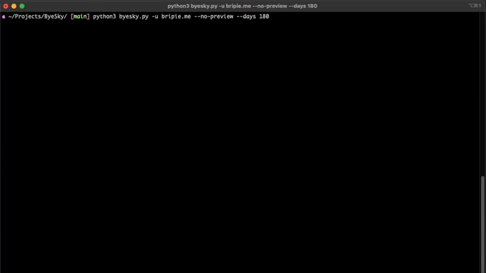

# ByeSky



ByeSky is a CLI tool to delete BlueSky posts older than a specified number of days, with advanced filtering, backup, preview and automation options.

## Motivation

I believe that opinions change, trends fade, and not every thought or post needs to live online forever. As someone who values privacy, I wanted a tool that empowers users to easily and safely clean up their BlueSky history giving them control over what remains public. ByeSky is designed to make it simple to review, filter, and remove old posts.

## Features

- Export logs
- Verbose and quiet modes
- Cron job friendly
- Advanced filtering (date, keyword, regex, replies, reposts)
- Backup deleted posts

## Disclaimer

**Warning:** This tool performs irreversible data deletion. Use with caution.  
Double-check your filters and options before running by using `--preview`.  

**The `--preview` option will only show what would be deleted and will NOT delete any posts.**  

**The `--no-preview` option will actually delete the matching posts.**  

The author is **not responsible** for any data loss or unintended consequences.

## Installation

1. Clone this repo:
    ```zsh
    git clone https://github.com/brianpierini/ByeSky.git
    cd ByeSky
    ```

2. [Create a BlueSky app password](https://bsky.app/settings/app-passwords).

### Option 1: Virtual Environment (Recommended)

```zsh
# Create a virtual environment
python3 -m venv venv

# Activate the virtual environment
source venv/bin/activate

# Install dependencies
pip install -r requirements.txt

# Run ByeSky (make sure venv is activated)
python byesky.py --handle yourhandle.bsky.social --days 30 --preview
```

### Option 2: Using pipx (macOS-friendly)

```zsh
# Install pipx (if not already installed)
brew install pipx

# Install ByeSky globally with pipx
pipx install .

# Run ByeSky
byesky --handle yourhandle.bsky.social --days 30 --preview
```

### Option 3: Direct Installation (Not Recommended)

```zsh
# Install dependencies globally (may cause conflicts)
pip3 install -r requirements.txt --break-system-packages
```

> **Note:**  
> ByeSky is compatible with Pydantic v2 and newer.  
> If you see errors about `.dict()`, upgrade Pydantic:  
> `pip install --upgrade pydantic`  
> Requires Python 3.8 or newer (recommended).

## Quick Start

```zsh
python3 byesky.py --handle johnappleseed@bsky.social --days 30 --preview
```

- By default, this will **preview** posts older than 30 days.
- To actually delete, add `--no-preview`.
- You will be prompted for your app password, or set it via the `BYESKY_TOKEN` environment variable.

## Usage

```zsh
python3 byesky.py [OPTIONS]
```

### Required

- `--handle`, `-u`  
  Your BlueSky handle (e.g., `johnappleseed@bsky.social`).

### Authentication

- `--token`, `-p`  
  Your BlueSky app password (16 chars). If omitted, you will be prompted.
  **Tip:** For automation, set the `BYESKY_TOKEN` environment variable.

### Age Filtering

- `--days`, `-d`  
  Delete posts older than this many days.  
  Example:  
  ```
  python3 byesky.py --handle johnappleseed@bsky.social --days 60 --preview
  ```

### Preview Mode

- `--preview/--no-preview`  
  Only show what would be deleted, do not actually delete.  
  Default: `--preview`  
  Example:  
  ```
  python3 byesky.py --handle johnappleseed@bsky.social --days 30 --preview
  ```

### Logging

- `--log-file`, `-l`  
  Override log file name.  
  Example:  
  ```
  python3 byesky.py --handle johnappleseed@bsky.social --days 30 --log-file mylog.txt
  ```

### Keyword/Regex Filtering

- `--match`, `-m`  
  Only delete posts containing this keyword or matching regex. Can be used multiple times.  
  Example (keyword):  
  ```
  python3 byesky.py --handle johnappleseed@bsky.social --days 30 --match hello --match world
  ```
  Example (regex):  
  ```
  python3 byesky.py --handle johnappleseed@bsky.social --days 30 --match '^foo.*bar$' --regex
  ```

- `--regex/--no-regex`  
  Interpret `--match` patterns as regex.  
  Example:  
  ```
  python3 byesky.py --handle johnappleseed@bsky.social --days 30 --match 'test\d+' --regex
  ```

### Date Range Filtering

- `--after`  
  Only consider posts after this date (inclusive).  
  Example:  
  ```
  python3 byesky.py --handle johnappleseed@bsky.social --after 2024-01-01 --preview
  ```

- `--before`  
  Only consider posts before this date (inclusive).  
  Example:  
  ```
  python3 byesky.py --handle johnappleseed@bsky.social --before 2024-06-01 --preview
  ```

### Backup

- `--backup-file`  
  Backup deleted posts to this JSONL file (default: `deleted_posts_backup.jsonl`).  
  Example:  
  ```
  python3 byesky.py --handle johnappleseed@bsky.social --no-preview --backup-file my_backup.jsonl
  ```

### Replies and Reposts

- `--include-replies/--exclude-replies`  
  Include or exclude replies (default: exclude).  
  Example:  
  ```
  python3 byesky.py --handle johnappleseed@bsky.social --preview --include-replies
  ```

- `--include-reposts/--exclude-reposts`  
  Include or exclude reposts (default: exclude).  
  Example:  
  ```
  python3 byesky.py --handle johnappleseed@bsky.social --no-preview --include-reposts
  ```

### Output Modes

- `--verbose`  
  Enable verbose output (DEBUG logging, show HTTP requests).  
  Example:  
  ```
  python3 byesky.py --handle johnappleseed@bsky.social --preview --verbose
  ```

- `--quiet`  
  Suppress most output except errors and summary.  
  Progress bars are still shown in quiet mode.  
  HTTP request logs are suppressed in quiet mode.  
  Example:  
  ```
  python3 byesky.py --handle johnappleseed@bsky.social --no-preview --quiet
  ```

### Example: Delete posts older than 6 months (for cron job)

```zsh
python3 byesky.py --handle johnappleseed@bsky.social --token YOUR_APP_PASSWORD --no-preview --days 180 --quiet
```

### Example: Delete posts after a certain date, including replies, with backup

```zsh
python3 byesky.py --handle johnappleseed@bsky.social --no-preview --after 2024-01-01 --include-replies --backup-file backup.jsonl
```

## Troubleshooting

### Error: `'NoneType' object is not callable`

This error typically occurs due to one of these issues:

#### 1. **Virtual Environment Not Activated**
If you're not using a virtual environment, you need to activate it first:

```bash
# Make sure you're in the ByeSky directory
cd /path/to/ByeSky

# Activate the virtual environment
source venv/bin/activate

# You should see (venv) at the start of your prompt
# Then run the script
python byesky.py --handle yourhandle.bsky.social --days 30 --preview
```

#### 2. **Pydantic Version Compatibility**
The most likely cause is an outdated Pydantic version:

```bash
# Make sure virtual environment is activated
source venv/bin/activate

# Upgrade Pydantic
pip install --upgrade pydantic

# Try again
python byesky.py --handle johnappleseed@bsky.social --days 30 --preview
```

#### 3. **Missing Dependencies**
Some required packages might not be installed properly:

```bash
# Make sure virtual environment is activated
source venv/bin/activate

# Reinstall dependencies
pip install -r requirements.txt
```

#### 4. **macOS Python Environment Issues**
macOS has an externally managed Python environment. If you don't have a virtual environment:

```bash
# Create a virtual environment
python3 -m venv venv

# Activate it
source venv/bin/activate

# Install dependencies
pip install -r requirements.txt

# Test the script
python byesky.py --help
```

#### 5. **Additional Debugging**
If the error persists:

- Run with `--verbose` flag to get more detailed error information:
  ```bash
  python byesky.py --handle johnappleseed@bsky.social --days 30 --preview --verbose
  ```
- Check if you can access your BlueSky account normally
- Try with a different handle or app password
- Try with a smaller date range first:
  ```bash
  python byesky.py --handle johnappleseed@bsky.social --days 1 --preview
  ```

### Check Your Setup
Run these commands to verify your environment:

```bash
# Check Python version
python3 --version

# Check if you're in a virtual environment
echo $VIRTUAL_ENV

# Check if you have a venv folder
ls -la | grep venv
```

## Security

- Use an app password, not your main BlueSky password.
- Consider using environment variables or a secrets manager for automation.

## License

MIT
